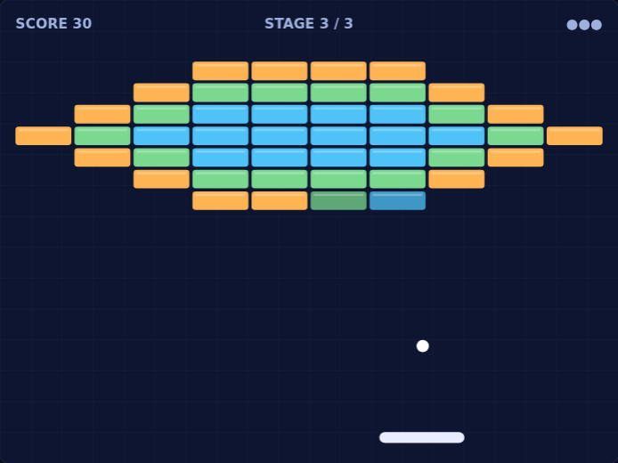
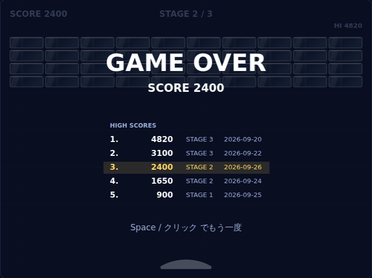
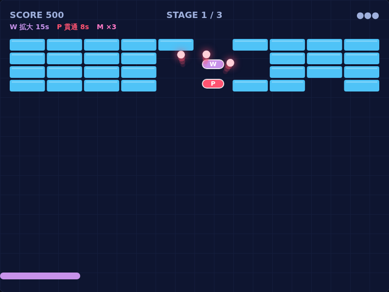
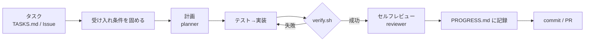

# ブロック崩し

ブラウザで動くブロック崩し。TypeScript 製で、実行時の依存パッケージはゼロ。



## 遊び方

```bash
npm install      # TypeScript (開発用) を入れる
npm start        # ビルドして http://localhost:5173 を開く
npm run dev      # 開発用: 保存すると自動で再ビルド (ブラウザは手動で再読み込み)
```

| 操作 | キーボード | マウス / タッチ |
| --- | --- | --- |
| パドル移動 | `←` `→` / `A` `D` | カーソル・指の位置に追従 |
| 発射 / 次へ | `Space` / `Enter` | クリック / タップ |
| 一時停止 | `P` / `Esc` | (タブを離れると自動で停止) |
| 消音 | `M` | |

- ブロックはガラス。強いブロックほどガラスが厚い (縁の線が 1〜3 本重なって見える)
- ボールが当たると、当たった点から放射状にひびが入る。ひびが増えるほど割れる寸前
- 割れると鉄筋を叩いたような「カーン」という音とともに、ボールの進む向きへ破片が散る
- パドルの上面はゆるい曲面 (端で30°傾いた円弧) で、端で打つほど角度が付く (最大60°)。ブロックに当てるたびにボールは少しずつ速くなる
- ライフは3機。全3ステージ

### ハイスコア

ゲームオーバーかオールクリアで、スコアが上位5件のランキングに記録される (到達ステージと日付つき)。画面右上の **HI** がベストスコアで、今のプレイがそれを超えると金色になる。

- 記録はブラウザの localStorage に保存される。端末・ブラウザごとに別々で、サーバーには送らない
- ランキングを消したいときは、ブラウザの開発者ツールで `breakout.highScores` を削除する



### パワーアップ

ブロックを壊すと、ときどき (18%) アイテムが落ちてくる。パドルで受け取ると発動する。

| アイテム | 効果 | 持続 |
| --- | --- | --- |
| **W** (紫) | パドルが 1.5 倍に広がる。残り2秒で点滅 | 15秒 (再取得で加算、最大30秒) |
| **M** (桃) | 画面上のボールがそれぞれ3つに分裂 (最大12個)。全部落とすまでミスにならない | 落とすまで |
| **P** (赤) | ボールがブロックを反射せずに突き抜け、耐久値に関係なく一撃で壊す | 8秒 (再取得で加算、最大16秒) |

ミスするかステージが変わると、効果と落下中のアイテムはリセットされる。



> [!tip] ステージを追加するには
> `src/game/levels.ts` の `LEVELS` に 10文字 × n行の文字列を足すだけ。`.` が空き、`1`〜`3` が耐久値。
> 形式の誤りやブロック同士の重なりはテストが検出する。

## 公開 (GitHub Pages)

`main` にマージすると、`.github/workflows/pages.yml` が型チェック・テスト・ビルドをして GitHub Pages に公開する。

- 公開先: `https://tinkling-way-games.github.io/crackout/` (2026-09-27 に Organization `tinkling-way-games` へ移管。旧 `tinklingway.github.io/crackout/` からのリダイレクトはない)
- リポジトリを別のオーナーへ移管すると Pages は引き継がれない (Actions・Issue・PR は引き継がれる)。移管後は上の初回設定をやり直し、手動で公開し直す
- 初回だけ、リポジトリの Settings → Pages → Source を「GitHub Actions」にしておく
- Settings → Environments → `github-pages` の Deployment branches に `main` が入っていないと、deploy ジョブが実行前に弾かれる
- Actions タブの「Deploy to GitHub Pages」から手動で公開し直すこともできる

## 開発

```bash
scripts/verify.sh   # 型チェック → ユニットテスト → ビルド → E2E (Claude も CI もこれを使う)
```

- `src/game/` は DOM に触らない純粋なロジックなので、Node 22 で `.ts` をそのままテストできる (`node --test`)
- E2E (`e2e/smoke.mjs`) は Playwright で実際にブラウザを開き、「キー操作 → 発射 → ブロック破壊 → 一時停止 → マウス操作」を確かめる。Playwright が入っていなければスキップする

---

# Claude Code 自走開発環境テンプレート

このリポジトリは、以下の自走開発テンプレートの上で Claude Code が作ったもの。

Claude Code に「タスクを渡したら、計画・実装・検証・記録・PR まで自分で回す」状態を作るための、言語非依存のテンプレート。

> [!summary] 考え方
> 自走の質は、モデルの賢さより **「完了の定義」と「検証の自動化」** で決まる。
> このテンプレートは、Claude が *何をすべきか* (CLAUDE.md / スキル)、*終わったと判断してよいか* (verify.sh + Stop hook)、*やってはいけないこと* (permissions + guard hook) の3つを仕組みで固定する。

## 構成

```
.
├── CLAUDE.md                     # 毎セッション読まれる基本ルール (短く保つ)
├── .claude/
│   ├── settings.json             # 権限 (allow/ask/deny) と hooks の登録
│   ├── hooks/
│   │   ├── session-start.sh      # 依存インストール + PROGRESS.md をコンテキストに注入
│   │   ├── guard-bash.sh         # 危険コマンドのブロック
│   │   ├── post-edit-format.sh   # 編集後の自動フォーマット
│   │   └── stop-verify.sh        # 検証が通るまで「完了」させない
│   ├── skills/
│   │   ├── autopilot/SKILL.md    # 自走の手順 (/autopilot)
│   │   └── steward/SKILL.md      # PR を緑にするときの運用ルール
│   └── agents/
│       ├── planner.md            # タスク分解
│       └── reviewer.md           # セルフレビュー
├── scripts/verify.sh             # lint/型/テストの単一入口 (人間・Claude・CI 共通)
├── docs/
│   ├── TASKS.md                  # バックログ (Inbox → Ready → Doing → Done)
│   └── PROGRESS.md               # セッションをまたぐ作業記憶
└── .github/
    ├── workflows/claude.yml      # Issue/PR で @claude と呼ぶと動く
    ├── workflows/ci.yml          # verify.sh を CI でも実行
    └── ISSUE_TEMPLATE/task.md    # 受け入れ条件つきタスクのひな形
```

## 使い方 (最短)

1. このリポジトリの中身を自分のプロジェクトにコピーする
2. `CLAUDE.md` の TODO (概要・コマンド) を埋める
3. `scripts/verify.sh` が自分のプロジェクトのテストを回すことを確認する
4. `docs/TASKS.md` の `## Ready` にタスクを書く
5. `claude` を起動して `/autopilot` と打つ

GitHub から回したい場合は、`claude` 内で `/install-github-app` を実行し、Issue テンプレート「タスク (Claude に任せる)」で Issue を立てる。

---

## 仕組みの詳細

### 1. 自走ループ



手順そのものは `autopilot` スキルに書いてあり、CLAUDE.md には要約だけを置いている。CLAUDE.md は毎回全文がコンテキストに載るため、長い手順はスキルに逃がしてコンテキストを節約する。

### 2. hooks が担うこと

| hook | タイミング | 役割 |
| --- | --- | --- |
| `session-start.sh` | セッション開始 | クラウド環境なら依存を入れる。ブランチ・未コミット件数・`PROGRESS.md` 末尾を Claude に渡す |
| `guard-bash.sh` | Bash 実行前 | ルート削除、main への push、force push、`.env` 読み出し、`curl \| sh` を exit 2 で止める |
| `post-edit-format.sh` | Edit/Write 後 | prettier / ruff / gofmt / rustfmt があれば整形 |
| `stop-verify.sh` | 応答を終える直前 | 変更があれば `verify.sh` を実行し、失敗なら exit 2 で差し戻す |

> [!important] Stop hook が自走の要
> 「テスト通りました」と言いながら実は通っていない、という事故を仕組みで防ぐ。
> 失敗すると stderr の内容が Claude に返され、Claude は修正を続ける。
> 無限ループを避けるため、`stop_hook_active` が true のとき (差し戻し後の2回目) は通す。
> 一時的に切りたいときは `CLAUDE_VERIFY_ON_STOP=0 claude` で起動する。

### 3. 権限設計

`settings.json` の `permissions` は3段階で分けている。

- **allow**: 読み取り系 git、テスト・lint 実行 → 確認なしで実行 (自走を止めない)
- **ask**: `git push`、パッケージ追加 → 人間が確認 (外に出る/環境を変える操作)
- **deny**: `.env` の読み取り、force push、`reset --hard`、`sudo` → 常に拒否

> [!tip] 慣れてきたら
> `git push` を allow に移すと、PR 作成まで完全に無人で回る。
> 逆に不安なうちは `claude --permission-mode plan` で計画だけ出させ、承認してから実行させるとよい。

### 4. 記憶の持たせ方

Claude はセッションをまたいで記憶を持たないので、ファイルに外部化する。

- `docs/TASKS.md`: 何をやるか (状態つき)
- `docs/PROGRESS.md`: 何をやったか・なぜそう判断したか・次は何か
- git 履歴: 何を変えたか

SessionStart hook が `PROGRESS.md` の末尾を毎回読み込むので、新しいセッションでも「前回の続き」から始められる。

### 5. 自走を拡張する方向

> [!example]- 定期実行 (放置で進める)
> Claude Code on the web の Routines (スケジュール実行) で「毎朝 `docs/TASKS.md` の Ready を1件 `/autopilot` で進めて PR を作る」ように設定すると、寝ている間にも PR が溜まる。
> ローカルなら `claude -p "/autopilot" --permission-mode acceptEdits` を cron から呼ぶ形でも同じことができる。

> [!example]- 並列化
> タスクごとに git worktree (`claude --worktree` や `EnterWorktree`) を切ると、複数の Claude を衝突させずに同時に走らせられる。
> クラウドなら1タスク1セッションで並べるのが簡単。

> [!example]- PR の見張り
> クラウドセッションで PR を作ったあと「この PR を見張って」と頼むと、CI 失敗やレビューコメントに反応して修正を push し続ける。その際の運用ルールは `steward` スキルが読まれる。

## カスタマイズの優先順位

1. **`scripts/verify.sh`** — ここが弱いと、Stop hook も CI も意味をなさない。まず最初に固める
2. **`CLAUDE.md`** — プロジェクト固有の「毎回守ること」だけを足す。長くしない
3. **Issue の受け入れ条件** — 自走の成果物の質は、ほぼここで決まる
4. **権限** — 慣れに応じて allow を広げる
